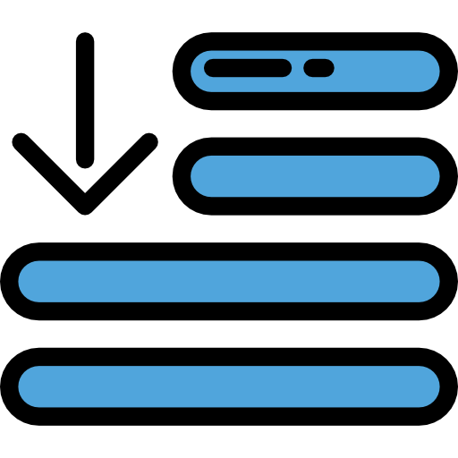

<p align="center">
  
  
</p>

<h1 align="center">Sortable List</h1>

<p align="center">Scratch implementation of a sortable list synced with firebase database !!</p>

## Clone
``` bash
git clone https://github.com/DipanshKhandelwal/sortable-list.git
cd sortable-list
```

## Run
``` bash
npm install
npm start
```

## Firebase
[Read about firebase](https://firebase.google.com/)

<div>Icons made by <a href="https://www.freepik.com/" title="Freepik">Freepik</a> from <a href="https://www.flaticon.com/" 			    title="Flaticon">www.flaticon.com</a> is licensed by <a href="http://creativecommons.org/licenses/by/3.0/" 			    title="Creative Commons BY 3.0" target="_blank">CC 3.0 BY</a></div>

## Author

[Dipansh Khandelwal](https://github.com/dipanshkhandelwal)
[](https://github.com/dipanshkhandelwal)
[](https://linkedin.com/in/dipanshkhandelwal)
